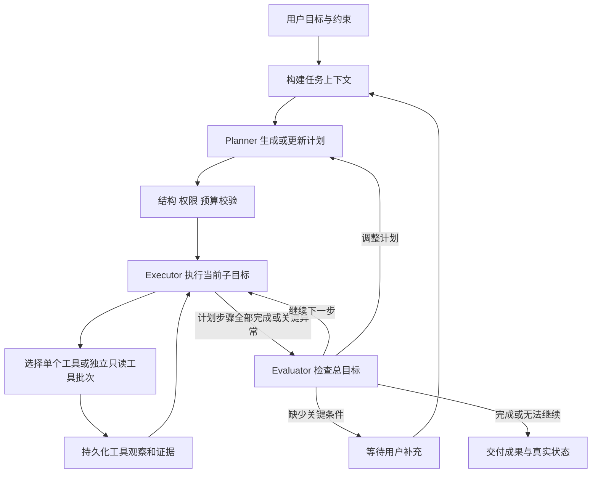

# 电商运营 Agent 产品需求文档

版本：v0.5（RAG 与记忆工程改造已实现；真实对话模型已接通，完整质量验收待完成）  
日期：2026-09-30  
项目：Operations Agent（暂定名）  
实施状态：已实现完整 RAG、任务内摘要与历史召回、确认式长期记忆、管理员公共资料及前后端管理。真实 BGE 向量/精排已在 Windows 与 PostgreSQL 环境验证；DeepSeek 思考模式下的规划、查询扩展、摘要和候选提取已通过真实接口连通验证，完整质量评测仍待完成。设计与逐项边界见 [docs/RAG_MEMORY_DESIGN.md](docs/RAG_MEMORY_DESIGN.md)，实际验证与限制见 [docs/VALIDATION.md](docs/VALIDATION.md)，启动方式见 [README.md](README.md)。

## 1. 需求状态与产品定位

### 1.1 已确认的需求

- 参考旧项目 [shop-agent](https://github.com/NothingToSay-Fear/shop-agent)，保留其中合理的设计。
- 在当前目录创建新项目，以真正具备动态规划、执行和重规划能力的 Plan-and-Execute Agent 为核心。
- 先沟通实现计划并形成 PRD，再进入实现阶段。
- 用户已授权按照本 PRD 开始实施。
- 避免在迭代过程中再次将业务决策固化成按意图分类的预设工作流。
- 主要面向商家，服务运营分析、商品优化、活动与库存决策。
- 首版仅提供分析和操作建议，不修改业务数据；内部报告、文案草稿和任务状态可以保存。
- 生成足够贴近真实电商后台的模拟数据，支持跨业务实体的分析与核对。
- 保留旧项目技术栈。
- 不包含店铺设计：不建立店铺实体、店铺归属字段、店铺选择或多店铺能力，也不以隐含的默认店铺替代。
- RAG 和记忆参考旧项目完整设计，一次性交付后端、前端、索引任务、模型部署、数据迁移和评测，不拆成基础版与后续补齐版本。
- 长期记忆需要用户确认后生效；候选不可进入 Agent 的长期记忆上下文。
- 不允许跨任务历史召回，包括同一用户自己的其他任务；当前任务内历史可以召回，已确认且有效的个人长期偏好可以跨任务使用。
- 保留用户个人资料与管理员公共资料；公共资料由每个用户独立启用，不引入店铺、团队或成员关系，也不共享用户任务或个人记忆。

### 1.2 沟通结论与建议基线

产品方向、执行范围、模拟数据和沿用技术栈已确认；具体数据规模、框架用法和实现阶段为建议方案。

| 决策 | 建议基线 | 对范围的影响 |
| --- | --- | --- |
| 主要用户 | 已确认：电商商家运营人员、运营负责人 | 聚焦经营分析、商品优化、活动与库存决策 |
| 首版数据源 | 已确认：足够真实的模拟电商后台数据；配套运营资料 | 首版无需真实平台账号，不以几个随机汇总数代替业务数据 |
| 业务数据组织 | 已确认：不包含店铺；商品、订单、库存、渠道与活动直接关联 | 不引入店铺 ID、店铺筛选或店铺级权限 |
| 执行边界 | 已确认：仅分析与建议，可保存内部交付物 | 不执行改价、上架、补货下单、投放或发消息 |
| 首版交付形态 | 可本地部署的 Web 工作台 | 包含后端 Agent 与最小前端 |
| 技术栈 | 已确认沿用旧栈：Python 3.12、FastAPI、LangChain/LangGraph、PostgreSQL/pgvector、React/TypeScript 等 | 保留工程基础，重写决策核心；依赖版本在实现前核验 |
| Agent 组织 | 单个逻辑 Agent，分离 Planner、Executor、Evaluator/Replanner 职责 | 不以多个具名子 Agent 作为首版前提 |

产品定位：用户给出经营目标与约束，Agent 自主拆解任务、选择工具、调查证据、根据观察调整计划，并交付可追溯的分析与运营成果。

首版“完成任务”指完成约定的调查、报告、文案或活动方案。改善 GMV 等经营结果需要真实执行与后续观测，不能以生成方案代替业绩达成。

## 2. 旧项目评估与继承策略

### 2.1 分析基线

本次阅读的是本地 `D:\project\shop-agent`，其 Git 远程地址为 `git@github.com:NothingToSay-Fear/shop-agent.git`。

- 本地提交：`113c47532da329c09f0334420850965188803620`。
- 提交时间：2026-09-28 19:17:02 +08:00。
- GitHub 页面和 API 本次未成功读取，未验证本地提交是否等于远程最新版本。
- 判断以实际源码为主。旧复盘文档与当前实现存在差异，例如文档仍描述部分维度未接入，而当前 `metric_rag.py` 已声明渠道和商品维度支持；真实数据覆盖度仍需接入时检查。
- 旧项目评估阶段仅做源码与文档审阅，没有启动或运行旧项目，不将其文档描述当作已验证能力；新项目的实际验证结果单独记录。

### 2.2 为什么它仍偏向工作流

| 源码位置（相对旧仓库） | 观察到的行为 | 对新设计的启示 |
| --- | --- | --- |
| `backend/app/agent/task_orchestrator.py`：`MainAgentOrchestrator.plan()` | 根据 operation 和 evidence_sources 拼接固定 Action；并非调用模型生成业务计划 | 让模型根据目标、能力与证据生成子目标及依赖 |
| 同文件：`replan()` | 接收下一层指标代码，只追加指标查询与证据评估 | 重规划需要支持增删、替换、排序、改变来源及终止 |
| `backend/app/agent/execution_plan.py`：`ROUTE_TOOL_NAMES` | 路由映射为代码级必调工具列表 | 工具使用由任务需要决定，权限校验不代替业务规划 |
| `backend/app/agent/data_query_agent.py`：`observe()` | 根据已查询指标和驱动图谱判定是否继续 | 图谱可提供领域知识，不能单独决定整个调查过程 |
| `backend/app/services/analytics/data_query_planner.py` | 关键词、已有约束和图谱共同决定查询计划 | 保留结构化参数和口径校验，将调查策略交给模型 |
| `backend/app/agent/workflow.py` | 已存在循环与重规划节点，但承载的业务动作及扩展方式受上述规则限制 | 有循环不等于有开放的业务决策空间 |

旧项目并非没有规划能力，而是规划与重规划主要由确定性业务规则驱动。新项目要改变的是决策权的归属，而非仅更换框架或类名。

### 2.3 保留、改造和暂缓

| 设计 | 策略 | 新项目要求 |
| --- | --- | --- |
| 指标定义、计算口径、结构化查询 | 保留并改造接口 | 查询范围由模型选择，权限、公式和计算由服务校验执行 |
| 文档解析、混合检索、精排、引用 | 复用设计，本次完整交付 | 结构化分块、后台索引、数据库召回、融合精排与引用；无需每个任务都检索资料 |
| 用户与资料访问隔离 | 保留 | 任务、会话、成果、资料、下载及事件流均验证用户访问权限 |
| 计划、步骤、尝试与运行审计 | 保留概念，重建统一状态模型 | 记录计划版本、变化原因、工具观察与恢复位置 |
| 会话摘要、历史召回和长期偏好 | 保留分层思想，本次完整交付 | 历史限定当前任务；长期记忆必须确认；不能覆盖当前明确指令或充当最新业务事实 |
| SSE、Markdown、表格展示 | 保留交互能力 | 增加可修改计划、进度、证据与交付物展示 |
| 固定意图路由和必调工具列表 | 重写 | 不作为通往业务能力的唯一入口 |
| 固定驱动指标扩展 | 转为可检索的领域知识 | Agent 根据观察选择是否继续验证 |
| 具名数据库/复盘子 Agent | 暂缓直接迁移 | 首先证明一个逻辑 Agent 可以动态完成任务 |

复用以独立服务、测试和工具契约为单位，不整包复制旧编排层，也不要求迁移旧数据库或用户历史。

## 3. 什么算本项目的 Plan-and-Execute Agent

### 3.1 必备能力

1. **目标驱动规划**：模型将用户目标、约束、可用能力转换为可执行且可验证的子目标。
2. **动态工具选择**：执行器可围绕当前子目标选择工具及参数，必要时多次调用。
3. **观察驱动决策**：新证据、错误、能力缺失或用户修正可以改变后续计划。
4. **持续保有目标**：执行过程中持续检查成功标准，避免查询完成就默认任务完成。
5. **有依据的终止**：能区分完成、部分完成、等待用户、阻塞、失败和取消。
6. **可恢复的执行**：刷新页面、断开连接或服务重启后，能够恢复状态并避免重复业务副作用。

简单问数允许只有一个计划步骤；复杂任务才需要多步骤和多次重规划。不为展示“自主性”强行增加调用。

### 3.2 模型与代码的职责边界

| 由模型决定 | 由确定性代码负责 |
| --- | --- |
| 如何拆解目标、先调查什么 | 用户身份、资源访问权限及业务数据只读约束 |
| 选择哪些可用工具和参数 | 工具 Schema、参数合法性、能力边界 |
| 证据是否足以继续或需要补充 | 指标公式、单位、计算、查询限额 |
| 如何修改尚未执行的计划 | 状态转移、依赖一致性、并发控制 |
| 是否需要澄清及如何表述 | 授权校验、幂等、超时与预算 |
| 如何综合证据形成成果 | 引用存在性、产物版本、审计与持久化 |

固定的运行循环和工具内部流程是必要的工程结构。禁止固化的是“某类经营问题必须按某套业务步骤执行”。这一边界也符合 [LangChain 官方对 workflow 与 agent 的区分](https://docs.langchain.com/oss/python/langgraph/workflows-agents)：前者使用预设路径，后者动态决定过程与工具使用。

## 4. 用户场景与范围

### 4.1 首版核心场景

| 场景 | 用户目标示例 | 交付物与完成条件 |
| --- | --- | --- |
| 经营诊断 | “找出过去七天销售下降的主要贡献项，给我三个可执行建议。” | 有口径的对比、贡献项、证据、未验证假设及优先行动 |
| 活动方案 | “结合商品、库存和活动规则，做一份下周促销方案。” | 有事实依据的选品与方案；缺失成本/库存时明确条件与限制 |
| 商品内容 | “优化这些商品的标题和卖点，遵循我上传的品牌规范。” | 可编辑的文案版本、事实来源与规则检查结果 |
| 库存决策 | “哪些 SKU 未来两周可能缺货？给出补货优先级和数量建议。” | 可用库存、在途、需求估算、交期及假设；不创建采购单 |
| 基础问数与追问 | “上周 GMV 多少？其中退款高的商品呢？” | 正确继承或更新范围，返回数据与定义，必要时生成新计划版本 |

### 4.2 P0：首版必须完成

- 动态计划、步骤内工具执行、观察评估和重规划闭环。
- 经营、商品、订单退款、库存、投放流量、知识资料、计算与内部交付物工具。
- 业务实体关联完整、可复现且可核对的模拟数据生成器与只读数据适配接口。
- 对话、任务、计划版本、执行状态和证据持久化。
- 用户补充条件、改目标、暂停、继续和取消。
- 用户任务、会话、成果与资料访问隔离，工具预算、失败处理和恢复。
- 最小 Web 工作台、过程事件流、Markdown/CSV 成果下载。
- 离线场景评测与实际模型的动态规划验收。
- 完整 RAG：结构化/语义分块、独立索引 Worker、数据库向量与全文召回、查询扩展、RRF、真实精排模型、引用定位与索引版本管理。
- 完整记忆：明确任务约束、按预算压缩的短期摘要、当前任务内历史召回、经用户确认的个人长期记忆及前端管理。
- 管理员公共资料、个人来源开关、权限撤销及检索缓存失效。

### 4.3 P1：首版闭环通过后

- 在后续用户确认后，对接一个真实电商或经营数据平台的只读接口。
- 按需联网获取公开信息，保留来源与检索时间。
- 可选隔离计算沙箱、必要时的专门子 Agent。

### 4.4 暂不覆盖

- 消费者购物、支付、自动退款、客服代发消息。
- 无需用户启动的全天候运营、自动投放和无限周期优化。
- 一次性接入全部电商平台、生产级多租户 SaaS 运维体系。
- 任意 Shell、任意文件访问、无限制 SQL 或浏览器自动化。
- 跨任务历史召回、跨用户共享个人记忆、自动将任务成果发布到公共资料库。
- 店铺建模、店铺管理、店铺切换、店铺级权限及多店铺对比。
- 对真实或模拟经营表执行改价、上架、补货、投放等业务写入；数据生成器仅供初始化与评测，不暴露为 Agent 工具。

P0 的 execute 包括实际查询、计算、读取资料及生成保存成果。只读分析同样可以包含完整的自主规划与执行闭环。未来业务写入需要单独讨论范围，不属于当前实施计划。

## 5. 核心运行设计

### 5.1 总体循环



上图定义通用控制循环，不定义电商业务路径。Executor 的内部循环以及外层重规划都受共享任务预算限制。

### 5.2 Planner

输入：用户目标、成功标准、明确约束、可用工具目录、授权范围、当前计划、已有证据摘要和剩余预算。

输出：结构化计划。每一步至少包含稳定 ID、子目标、依赖、完成标准和状态；可以声明建议能力，但不提前锁死尚无依据的全部工具参数。

- 先生成适度粒度的计划；执行过程中逐步细化。
- 自然语言理解可提出时间、指标或商品范围假设，含糊且会显著改变结果时才追问。
- 能查到的商品、活动和字段信息优先通过工具查询。
- 不用任务类别枚举限制能否完成新的组合任务。
- 计划 Schema 无效时，将具体错误反馈给模型修正；最多两次仍失败则明确失败，不回退成隐蔽固定业务模板。

### 5.3 Executor

执行器只负责当前子目标，获得总目标、相关约束、必要证据与可用工具。

- 模型自主选择工具和参数，工具调用先通过确定性网关。
- 可以连续检索、读取原文、查询不同维度或调用计算工具。
- 输出包含实际成果、证据 ID、发现、缺口与失败情况。
- 当前步骤需要改变任务范围、依赖或策略时，交回 Replanner。
- 一次结构化动作最多选择 6 个无依赖的只读调用并发执行；成果保存和记忆候选等写入工具必须单独执行。

### 5.4 Evaluator / Replanner

计划步骤全部完成、发生关键错误、需要重规划或预算收尾时检查目标覆盖度，输出有限的控制决策：`continue`、`replan`、`ask_user`、`finish`、`stop`。中间步骤完成后直接进入下一个满足依赖的步骤，不重复执行全局评估。

- 控制决策类型固定，业务计划内容由模型生成。
- 重规划支持新增、替换、取消和重排未执行步骤，保留已执行记录。
- 每次变更保存版本、前后差异、简短原因和触发证据。
- 下游依赖的证据被用户修正或新数据推翻时，标记相关结果失效并重新执行必要步骤。
- 引用和数据完整性检查通过，不代表业务解释正确；仍需评估证据与结论的关系。
- 证据不足但无法继续时返回部分成果及缺口，不能宣称找到根因。

### 5.5 任务状态与恢复

任务状态：`created`、`running`、`waiting_user`、`paused`、`completed`、`partial`、`blocked`、`failed`、`cancelled`。当前范围不需要业务审批状态。

步骤状态：`pending`、`running`、`succeeded`、`failed`、`skipped`、`cancelled`。跳过不等于成功；依赖未满足时由重规划决定替代方案。

- `Task` 表达持续目标，`Run` 表达一次启动或恢复执行，两者不等同于一条聊天消息。
- 用户补充条件产生约束版本；旧条件影响的未完成步骤与依赖证据应重新评估。
- 同一任务只允许一个有效执行租约，避免重复恢复并发运行。
- 暂停和取消在工具边界检查；已在外部发生的动作必须如实核验，不能仅取消前端展示。
- 浏览器断线不等于任务取消。SSE 使用事件序号支持续传。
- 长期记忆与会话摘要不能作为已执行动作的事实来源。

建议利用运行时 checkpoint 配合业务记录实现恢复；持久化本身不保证外部副作用只执行一次。关于恢复与 checkpoint 的框架能力参考 [LangGraph 官方持久化文档](https://docs.langchain.com/oss/python/langgraph/persistence)，具体整合方式需原型验证。

## 6. 工具与数据要求

### 6.1 首版工具目录

以下是建议契约，名称可在技术设计中调整。

| 工具 | 作用 | 关键约束 |
| --- | --- | --- |
| `inspect_data_capabilities` | 获取数据源、字段、维度、时间覆盖与刷新状态 | 仅展示当前用户可访问能力 |
| `get_metric_definitions` | 查看指标公式、单位、支持维度和适用范围 | 定义带版本，不能由模型随意改写 |
| `query_metrics` | 查询指标、时间、过滤条件、分组与对比数据 | 结构化参数、权限过滤、行数/超时限制 |
| `get_products` | 获取商品属性、价格及已接入库存/成本 | 缺失字段明确为空，不猜测 |
| `query_order_facts` | 查询订单、明细、支付、退款及履约的受控聚合/样本 | 按业务键关联，限制行数；只返回必要的合成客户标识 |
| `query_inventory` | 查询库存余额、流水、预占、在途和补货交期 | 明确 SKU、仓库、时点和库存状态 |
| `query_marketing` | 查询渠道流量、投放费用、曝光点击与活动归属 | 区分平台归因与订单来源，禁止重复累计归因收入 |
| `search_knowledge` | 检索活动、品牌规范和运营资料 | 检索前按身份和所选资料范围过滤 |
| `read_document` | 读取命中片段的必要上下文 | 来源、版本、定位和长度限制 |
| `calculate` | 执行差异、比率、贡献拆解及方案计算 | 使用经过校验的表达式或计算算子，禁止任意代码执行 |
| `save_artifact` | 保存报告、表格、文案和方案版本 | 限定任务空间，内容可追溯、可下载 |

澄清、暂停与完成是控制协议，不要求伪装成外部业务工具。最终计划与完成状态需真实持久化。

工具输出统一包含：状态、结构化数据或产物引用、来源、时间范围、口径版本、数据更新时间、警告，以及失败时的错误码和是否可重试。

工具内部可以采用 SQL 模板、检索融合等确定性流程；这些工具提供能力，不决定整项任务的业务步骤。

### 6.2 指标与数据质量

- 示例数据使用下述生成规范；最小冒烟集也应覆盖至少 28 天、多个渠道与 SKU，并包含销售、订单、访客、退款及商品属性。
- 任何演示成果明确显示模拟数据标记，不与真实数据混合统计。
- 时间范围展示具体起止日、时区及数据完整性；默认业务时区建议 `Asia/Shanghai`，允许配置。
- 指标定义区分支付 GMV、退款后净额、订单数和人数；按源系统口径展示名称。
- 若使用订单数/访客数，标明是该定义下的比率，不能无条件称作支付人数转化率。
- 比率从可聚合分子和分母计算；日去重访客不能简单相加当作周期去重访客。
- 退款发生日口径与订单归属期口径必须区分，活动归因仅在支持的数据范围内开展。
- 零分母、空结果、缺失值与真实零值分别处理；同比/环比不可计算时明确显示。
- 货币计算使用 Decimal 或整数最小货币单位，舍入规则一致。
- 查询结果带可复查的过滤条件、采集时间和快照/版本信息；不承诺所有平台具备历史快照能力。

### 6.3 证据与成果

- 数值、商品属性、规则和其他外部事实必须关联对应查询或文档证据。
- 区分数据事实、用户提供的信息、资料解释、待验证假设与建议。
- 不将相关性或算术贡献直接写成因果结论。
- 对预算、库存、成本缺失的方案采用显式条件，不能生成伪精确预测。
- 产物记录任务、版本、依据和生成时间；更新成果保留可访问的前版本。
- 原始证据与摘要分开存储。压缩上下文后仍能按 ID 读取所需证据。

### 6.4 模拟电商后台：真实性要求

“足够真实”定义为业务关系、时间过程、数值分布与数据质量具有电商特征，且可通过约束与对账检查验证；不宣称数据来自真实经营系统，也不照搬真实个人信息。

**建议默认规模（可配置）**：180 天、3 个仓库、4–6 个渠道、50 个 SPU、约 200 个 SKU、约 5 万笔订单。另提供小型开发集和更大压力集。真实资源消耗在实现中测量，规模不是固定性能承诺。

每个部署使用一套经营数据，直接通过商品、订单、仓库、渠道与活动的业务键关联。不建立店铺表，不添加 `shop_id` / `store_id` 等店铺归属字段；渠道表示流量或营销来源，仓库表示库存位置，二者均不承担店铺或租户隔离职责。

| 数据域 | 最小实体与内容 | 关联和时间要求 |
| --- | --- | --- |
| 商品 | 类目、SPU、SKU、属性、上下架区间、价格与成本历史 | 成交时价格/成本独立留存，不能用当前价格重算历史 |
| 订单 | 订单、订单行、优惠分摊、运费、客户合成 ID、来源渠道 | 支持一单多 SKU，明细与订单金额可对账 |
| 支付与履约 | 支付记录、取消、发货、签收事件 | 支持未支付、超时取消和分批履约，时间顺序合法 |
| 售后 | 退款申请、审核、到账、退货、原因及数量 | 支持部分退款、跨期退款，区分退款与退货入库 |
| 库存 | SKU/仓库期初、采购入库、预占释放、出库、退货入库、调拨及盘点 | 库存余额由流水推导，可用量与实物量明确区分 |
| 补货 | 供应商交期、采购在途、预计/实际到货、最低订货量 | 支持到货延迟；未来实际结果不在预测时泄漏给 Agent |
| 流量与广告 | 渠道/商品浏览或会话事实、曝光、点击、花费、合成访客标识 | 可按约定口径去重；转化与订单具有合理概率关联 |
| 活动 | 活动范围、参与商品、时间、优惠规则、渠道与预算 | 活动订单关联实际优惠，活动重叠不重复统计收入 |
| 知识资料 | 品牌规范、活动规则、商品资料、售后说明及历史复盘 | 文档日期、商品 ID 和规则版本与业务表一致 |
| 数据接入 | 来源记录 ID、业务发生时间、采集时间、数据批次 | 支持迟到数据、重复导入去重及数据截止时间 |

生成方法与约束：

1. 先生成主数据、经营配置和事件日历，再生成流量、订单、支付、履约、退款与库存流水，最后由事实表聚合指标。不能分别随机生成互相无关的 GMV、订单数、库存和退款率。
2. 配置可复现随机种子、固定业务时钟和生成器版本，同一配置产生相同业务结果；提供生成清单和对账报告。
3. 模拟工作日/周末差异、促销峰值、商品销量长尾、不同渠道质量、价格/促销对需求的影响及合理随机波动，不把每次下降都设计成单一明确原因。
4. 用户、客户、地址等字段使用合成标识；无需精确个人信息的场景不生成对应字段。
5. 退款不超过可退实付金额和数量；取消未发货订单释放预占；退款不自动等同于库存回补，退货验收入库后才计入。
6. 对库存按 SKU/仓库验证期末实物量 = 期初量 + 入库 - 出库 + 调整；预占单独核算。模拟允许缺货时应体现售罄或受限订单，不能无解释制造负可用库存。
7. 优惠按明确规则分摊到订单行，累计退款和净收入按定义核对；货币舍入差异采用明确尾差处理。
8. 混入有限的晚到记录、缺失投放数据、重复导入、退款跨期与部分日数据；区分原始接入层和清洗后事实层，避免把人为损坏的数据库约束当作“真实性”。
9. 文档可含过期规则或相互冲突的版本，要求 Agent 检查适用日期；资料中不直接写出隐藏评测的答案。
10. 数据截止时点既约束业务时间，也约束当时已采集的信息；模拟回测不得读取未来签收、退款、销量或真实到货结果。

至少提供五种可切换情境：流量下降、促销抬高 GMV 但压低毛利、爆款缺货、特定商品跨期退款增多、供应延迟导致库存风险。另提供无明显异常和多个因素混合的对照情境。

隐藏情境配置与预期贡献范围只供评测器读取，不进入 Agent 工具目录、资料库或提示词。Agent 根据可观察事实分析，而不是读取场景答案。

生成器属于开发/评测基础设施；Agent 使用只读业务数据库账号。报告与任务存储使用独立权限，写内部产物不能顺带获得经营表写权限。

### 6.5 库存与活动建议的边界

- 补货建议至少展示需求估算窗口、当前可用量、在途、预计到货、交期、最低订货量和覆盖天数。
- 需求估算区分正常销售、促销销售与缺货截断；历史销量低可能来自缺货，不能直接推断需求低。
- 安全库存、目标服务水平和未来活动影响如未给定，采用显式可调整假设，不声称精确预测。
- 提供基准/保守等有限情境和建议数量的计算依据；调用计算工具得出数值。
- 活动建议联合检查可售库存、成本、优惠规则和履约能力，输出毛利约束与缺失信息。
- 所有建议以内部成果形式交付；不更新库存、不生成真实采购、不发布促销。

## 7. 权限、授权与运行约束

### 7.1 工具权限

具有经营数据访问权限的用户读取同一套经营数据，不按店铺分区。用户的会话、任务、内部成果和个人资料按所属用户隔离；管理员公共资料按每个用户独立选择的启用范围使用。

| 能力 | P0 建议行为 |
| --- | --- |
| 已授权业务数据和资料读取 | 自动执行 |
| 计算、报告、内部草稿保存 | 自动执行 |
| 不在授权范围的数据访问 | 拒绝，由工具层落实 |
| 商品发布、改价、补货、投放、发消息等业务写入 | 当前范围不接入，也不修改模拟经营表 |

以下仅为未来扩展约束，不计入当前实施范围：若另行决定接入真实写操作，先生成包含对象、旧值、新值、影响和范围的操作预览。批准绑定用户、任务、操作参数摘要、对象版本和有效期；参数或前提变化则重新校验授权，不能借批准修改其他对象。

外部动作持久化操作 ID 与幂等键；超时后先核验外部状态。平台没有幂等或状态查询能力时，不承诺 exactly-once，结果未知的动作转人工核对，不能盲目重试。

### 7.2 预算与失败处理

建议原型默认上限：每轮用户问题 30 次模型调用、20 次业务工具调用、5 次重规划、5 分钟活跃执行时间；步骤内最多 6 次工具调用。用户明确追问开启新轮次，累计 Token 和成本不清零；后台摘要与候选提取使用独立维护上限。具体值经过评测再确定。

- 等待用户的时间不计入活跃执行时间，恢复不得隐式重置已消耗预算。
- 记录 token 用量与可获得的成本信息；价格配置缺失时标记成本未知。
- 暂时性只读错误有限重试，建议最多两次；参数错误返回模型修正，权限错误不重试。
- 相同调用在同一数据版本下反复返回无新增信息时，触发停滞检查；必要轮询须单独声明。
- 工具超时、调用重试、格式修复都计入预算。
- 预算耗尽时保存现有成果与剩余工作，状态为部分完成或阻塞，不能标记成功。
- 模型不可用时保留任务、证据与恢复入口，不伪装成已经完成自主规划。

外部文档和网页是数据，不是可修改系统权限的指令。检索权限必须在召回阶段过滤，模型输入和审计日志不得包含密钥。

## 8. 交互与功能需求

### 8.1 工作台

以对话为入口，以任务为工作单元。主区域展示当前目标、Agent 进展和交付物；侧栏或展开面板提供计划与证据。

- 用户提交目标后即可看到“已接收”和当前状态。
- 显示初始计划、当前步骤、已完成工作及计划更新原因。
- 计划默认自动运行，普通只读任务无需逐步批准。
- 用户可通过自然语言修改范围，也可暂停、继续或取消。
- 缺少关键条件时集中询问；界面显示等待原因及已完成成果。
- 成果可打开、编辑或下载，引用能定位到数据范围或文档片段。
- 默认展示简短行动说明、事实和变更理由，不展示冗长内部推理。
- 技术审计放在展开视图，普通用户不必理解节点、Prompt 或 checkpoint。

### 8.2 功能验收表

| ID | 需求 | 验收条件 |
| --- | --- | --- |
| FR-01 | 目标与约束理解 | 记录当前目标、成功标准和条件来源；不把历史偏好覆盖到本轮明确条件 |
| FR-02 | 模型生成计划 | 真实模型产生结构化子目标，留存版本；不是由固定业务模板填充 |
| FR-03 | 自主执行 | 当前子目标可调用不同工具组合，调用与观察均可追溯 |
| FR-04 | 动态重规划 | 新观察可导致增删/替换步骤，并保留触发证据与版本差异 |
| FR-05 | 目标完成检查 | 成功标准逐项关联成果或证据；缺项不得无说明标记完成 |
| FR-06 | 用户干预 | 修改目标后使用新约束，取消后不启动新的工具动作 |
| FR-07 | 证据交付 | 关键事实能定位来源；缺失和推断被明确区分 |
| FR-08 | 持久化与恢复 | 刷新、断线和进程重启测试中能恢复；无重复保存同一逻辑产物 |
| FR-09 | 权限隔离 | 通过越权 ID 访问其他用户的任务、会话、成果、私有文档或事件流均被拒绝 |
| FR-10 | 预算与失败 | 无限重试、无进展循环和预算超限有可见终止及真实状态 |
| FR-11 | 可复用能力 | 新增一个符合工具协议的工具，无需修改业务路由和核心执行循环 |
| FR-12 | 基础成果管理 | 报告/文案/表格能保存、查看版本并下载 |
| FR-13 | 真实感模拟数据 | 固定种子可复现，订单/退款/库存对账通过，覆盖五类情境及对照集 |
| FR-14 | 业务只读 | Agent 数据库身份不能更新经营表，工具目录无业务写入或数据重置入口 |
| FR-15 | 库存与活动决策 | 建议包含库存/交期/成本依据、计算及假设，无未来事实泄漏 |
| FR-16 | 无店铺设计 | 数据模型、工具参数、任务上下文和界面不包含店铺实体、归属字段、筛选或切换功能 |
| FR-17 | 完整 RAG | 结构化定位、异步索引、真实向量/全文召回、RRF 和真实精排端到端通过；失效来源不可再次使用 |
| FR-18 | 任务内记忆 | 预算压缩保留明确约束与来源，历史检索仅命中当前任务；同一用户其他任务也不可召回 |
| FR-19 | 确认式长期记忆 | 候选确认前不可采用；确认、编辑、替代、过期、停用和删除可追踪，当前指令优先 |
| FR-20 | 管理员公共资料 | 管理员上传内容固定进入管理员资料范围，不提供管理员个人资料选项；每个用户的启用开关在召回和读取时独立生效 |
| FR-21 | 完整交付验收 | 迁移、模型部署、后台恢复、前端管理和真实模型评测同批交付；不以代码路径存在替代真实验证 |
| FR-22 | 会话删除 | 用户可永久删除自己的会话；任务状态、运行、事件、证据、成果、任务历史、摘要、后台作业、记忆候选及由该会话确认生成的长期记忆在同一事务中清理，其他用户资源、独立长期记忆和公共资料不受影响 |
| FR-23 | 多轮会话展示 | 同一会话按时间展示全部用户问题与 Agent 回复；刷新页面或继续追问不得覆盖此前回答，失效资料支持的旧回复应明确隐藏 |

## 9. 建议技术结构

### 9.1 模块职责

```text
frontend/                 对话、任务计划、证据、成果与控制入口
backend/app/
  api/                    鉴权、任务、事件流、产物与资料接口
  agent/
    planner/              初始规划与计划修订
    executor/             当前子目标的工具调用循环
    evaluator/            目标检查、停止与重规划决策
    context/              任务约束、证据摘要和上下文装配
    runtime/              状态、checkpoint、预算与恢复
  tools/                  工具定义、注册、校验与统一执行网关
  domain/                 指标、商品、活动和产物领域服务
  connectors/             模拟数据与真实平台适配
  knowledge/              文档解析、索引版本、混合检索与引用
  memory/                 任务摘要、任务内历史、候选确认与长期偏好治理
  persistence/            数据模型、仓储和迁移
  workers/                Agent 后台任务和资料索引
  evaluation/             固定场景、故障注入和质量评测
docs/                     后续技术设计和使用说明
PRD.md                    本文档
```

这是职责边界建议，不要求原型立刻创建全部目录。

### 9.2 核心对象

| 对象 | 最小职责 |
| --- | --- |
| Task | 所属用户、目标、成功标准、约束版本、状态和总预算 |
| Run | 一次执行或恢复的配置版本、租约、耗时与用量 |
| PlanVersion / PlanStep | 版本、子目标、依赖、验收条件、状态和变更缘由 |
| ToolCall / Observation | 参数摘要、工具版本、执行状态、结果引用及错误 |
| Evidence | 来源、查询范围/片段位置、口径、时间和权限范围 |
| Artifact | 内容或存储位置、版本、任务归属和引用 |
| TaskEvent | 按序追加的可重放事件，用于前端续传和审计 |
| TaskMessage / TaskConstraintState / TaskConstraintEvent | 完整消息、唯一生效的结构化约束及其版本变更来源 |
| TaskMemory / HistoryUnit | 当前任务滚动摘要、有限近期窗口与可按需召回的历史单元；历史索引严格绑定 task_id |
| ModelContextSnapshot | 每次模型调用采用的约束/摘要版本及消息、记忆、证据、历史单元 ID 清单 |
| MemoryCandidate / UserMemory | 待确认内容和已确认的个人长期偏好；候选不可召回，不存为实时经营数据 |
| User.is_admin / DocumentScope.shared | 管理员身份与公共资料范围；公共资料不授予用户读取他人任务、成果或个人记忆的权限 |
| DocumentVersion / IndexJob | 资料版本、原文定位、索引进度、发布切换与恢复 |

运行时 checkpoint 服务于恢复，业务数据库服务于任务与成果查询。技术设计必须定义两者的一致性和恢复规则，避免维护两套互相矛盾的完成状态。

### 9.3 沿用技术栈与框架使用原则

- 后端沿用 Python 3.12、FastAPI、Pydantic、SQLAlchemy、Alembic 和 PostgreSQL/asyncpg。
- Agent 沿用 LangChain 模型与工具接口、LangGraph 状态运行时，重写模型驱动的规划和执行逻辑。
- 检索沿用 pgvector、Sentence Transformers/BGE、全文/BM25、RRF 和 Cross-Encoder；默认完整部署向量与精排模型并真实验收。模型异常时可显式降级，但不能将降级运行视为完整检索验收通过。
- 前端沿用 React、TypeScript、Vite、Ant Design、SSE 与 Markdown/表格渲染；交付沿用 Docker Compose、pytest。
- LangGraph 使用 `guard`、`plan`、`execute`、`tools`、`evaluate` 显式节点承载通用循环，图中不增加“GMV 分析”“618 复盘”一类业务专属路径。
- Planner、Executor 与 Evaluator 可使用同一模型的不同上下文和输出契约，无需多 Agent 系统才能实现。
- 模型要求可靠的工具调用与结构化输出；具体供应商和型号尚待用户决定及基准评测。
- 旧 `AGENTS.md` 提到 DeepAgent，但本次所读 `requirements.txt` 未包含 `deepagents` 依赖；因此以实际 LangChain/LangGraph 技术栈为实现基线。若采用 Deep Agents，先核验需求，不把其 todo 列表等同于完整计划执行协议。
- 长任务由后台执行，HTTP/SSE 只负责提交与观察；P0 可用数据库任务租约，不提前引入复杂分布式基础设施。

## 10. 证明它是 Agent 的验收方法

### 10.1 同一目标，不同观察

固定用户问题：“分析过去七天 GMV 下降的主要贡献项，并提出三个建议。”

| 测试环境 | 期望行为（允许不同合理路径） |
| --- | --- |
| A：访客下降，订单/访客比率与客单价稳定 | 重点验证流量与渠道贡献，减少无关调查 |
| B：访客稳定，少数 SKU 的订单/访客比率下降，库存证据可用 | 主动调查 SKU 和库存，并区分贡献与因果假设 |
| C：汇总与渠道明细口径不一致 | 检查口径与数据质量，不直接输出精确根因 |
| D：一个数据源超时，存在可用替代来源 | 在权限和预算内选择替代证据并解释时效差异 |
| E：无法获取关键维度，也没有替代来源 | 交付已知贡献和缺口，明确部分完成 |

验收重点是工具参数、证据选择、计划变化与最终结论会随观察合理改变；不要求每次生成相同措辞或严格相同调用顺序。

### 10.2 必须覆盖的评测

- 未见过的组合任务，例如将退款指标、品牌规范和商品文案要求放入同一目标。
- 工具返回空数据、错误参数、权限不足、超时及格式错误。
- 用户在执行中修改商品/渠道范围、时间范围、目标或取消任务。
- 服务在工具调用前后和产物保存前后退出，再恢复执行。
- 不可信文档要求忽略规则或访问其他用户数据。
- 相同参数无效重试、预算耗尽、依赖被取消和证据失效。
- 模拟数据固定种子重建、主外键完整性、订单金额/退款/库存对账、迟到数据截止及情境答案隔离。
- 检查数据模型、工具契约和界面不存在店铺归属字段、必填店铺参数或隐含的默认店铺依赖。
- 库存缺货导致销量受限、在途延迟、促销毛利受损，以及未获得未来数据时的建议合理性。
- 新工具注册后，模型在适合场景中主动选择使用。
- 未来若另行引入业务写入，再增加批准后参数变化、结果未知、重复批准和外部对象版本变化的专项验收；不计入本次 P0/P1。

### 10.3 建议发布门槛

以下是待验证的目标，不是已达到的测量结果。

| 指标 | 原型/首版目标 |
| --- | --- |
| 固定场景任务成功率 | 至少 30 个场景、每场景运行 3 次，覆盖诊断/商品/活动/库存；总体 ≥85%，并报告逐场景结果 |
| 动态适应 | A/B/C 三组观察干预各运行至少 5 次，≥80% 运行符合对应行为标准 |
| 关键事实可追溯率 | 评测集中 100% 关键业务数值和规则有可定位来源 |
| 数值正确性 | 固定数据集的金额、比率与范围计算断言全部通过 |
| 数据真实性基础 | 所有主外键、金额、退款、库存对账断言通过；五种情境与对照数据可复现 |
| 权限与只读 | 所有越权测试通过，Agent 业务数据库账号写入尝试全部被拒绝 |
| 恢复与副作用 | 固定故障注入场景中无重复逻辑产物 |
| 任务接收反馈 | 本地目标环境 P95 ≤2 秒，模型规划时间单独记录 |
| 成本与时延 | 每任务记录模型/工具调用、token、总耗时，设定模型和机器后再确定 SLA |

工程测试使用可控模型替身验证协议、状态、预算与恢复；真实模型场景评测验证自主规划和业务质量。前者通过不能替代后者。语义结论由评测 rubric 与人工抽检共同判断，不仅用另一个模型打分。

## 11. 实现计划与阶段出口

以下阶段 0—3 保留为 v0.4 原始实施记录，不再适用于本次 RAG 与记忆改造的交付拆分。v0.5 按 [完整改造方案](docs/RAG_MEMORY_DESIGN.md) 一次性交付，内部开发允许按依赖排序，但不得把索引、精排、长期记忆、公共资料、前端或真实验收移至下一阶段。

### 阶段 0：确认范围与原型设计

- 固化已确认的商家场景、分析建议边界、无店铺设计、真实感模拟数据与旧技术栈；继续讨论架构和首版优先级。
- 明确一个代表性复杂目标及至少三个不同观察分支。
- 输出模型协议、工具契约、状态和证据模型的最小技术设计。
- 出口：范围、成功标准和待解决依赖清楚，可以开始原型实现。

### 阶段 1：最小 Agent 闭环

- 实现 Planner → Executor → Observation → Evaluator/Replanner。
- 先实现小规模、可对账的模拟订单/商品/库存/渠道事实及三种观察情境，接入查询、规则检索、计算和产物工具。
- 实现基本任务持久化、计划版本、预算及轨迹记录。
- 先用 CLI 或最小调试界面验证，不先建设完整运营后台。
- 出口：同一问题不同数据可以产生合理不同调查路径，且有真实模型证据；若未通过，先修决策核心。

### 阶段 2：可靠数据与完整任务状态

- 扩展成完整模拟后台生成器，涵盖订单、支付退款、履约、库存、投放、活动及配套资料；交付种子配置、数据字典和对账报告。
- 迁入经核验的旧项目指标与检索能力，移除对旧路由的依赖。
- 完成权限范围、来源定位、暂停恢复、用户修改和失败处理。
- 建立固定评测数据、故障注入和回归门槛。
- 出口：核心场景结果正确、权限测试通过、任务可恢复且不会伪报完成。

### 阶段 3：首版工作台

- 接入对话、计划进度、变更原因、证据和成果下载。
- 支持任务暂停、继续、取消、自然语言修正以及事件续传。
- 完成基础资料上传、来源选择和本地部署说明。
- 出口：用户无需调试工具即可完整完成经营诊断、商品优化、活动和库存四类场景，达到 P0 验收。

### 阶段 4：按需扩展真实只读平台（后续选项）

- 根据已选平台验证 API 权限、字段、限流和数据口径，接入真实只读数据。
- 根据实测瓶颈决定是否引入专门子 Agent、更多平台及主动任务。
- 出口：一个真实平台端到端只读可用，数据口径经过核对。此阶段需后续明确平台后纳入范围。

当前不承诺日历排期。模型、人员投入和模拟数据规模明确后再估算，优先用阶段出口控制范围；真实平台不是首版启动依赖。

## 12. 防止后续再次退化的工程约定

1. 增加业务场景优先补工具、领域知识和评测，不优先添加路由分支。
2. 核心循环不得引用活动名称、指标专属诊断步骤或问题关键词来生成固定计划。
3. 计划必须进入真实执行；不能先按固定流程执行，再生成一份计划用于展示。
4. 工具返回可复用的结构化事实，不在工具内部包办整项开放任务。
5. 完成依据是用户目标和成果质量，不是某个预设工具列表全部被调用。
6. 允许不同合理执行轨迹，测试只固定业务正确性和必要约束。
7. 每次修改 Planner/Executor 提示词、模型或工具契约，运行观察干预与任务成功率评测。
8. 不删除权限、计算和持久化约束来换取表面上的自由度。

## 13. 待用户讨论的决策

| 问题 | 当前建议 | 状态 |
| --- | --- | --- |
| 面向商家运营，还是消费者购物？ | 商家运营，含分析、商品、活动和库存 | 已确认 |
| 首版数据源是什么？ | 生成足够真实的模拟电商后台数据 | 已确认；规模和实体细节为本文建议 |
| 是否包含店铺设计？ | 不包含店铺实体、归属字段、切换、权限维度或多店铺能力 | 已确认 |
| 首版是否修改业务数据？ | 只提供分析与操作建议，不修改业务数据 | 已确认 |
| 哪些旧设计必须本次保留？ | 指标口径、完整 RAG、摘要与任务内历史、经确认长期记忆、资料共享与隔离 | 已确认；完整改造范围见专项方案 |
| 长期记忆是否需要确认？ | 候选经用户确认后才生效 | 已确认 |
| 是否允许跨任务历史召回？ | 不允许；长期偏好可跨任务使用，历史内容仅限当前任务 | 已确认 |
| 公共资料如何管理？ | 不建团队；管理员上传内容固定为管理员资料且无个人范围，每个用户独立启用 | 已确认 |
| 是否继续使用现有技术栈？ | 沿用旧项目实际技术栈，重写 Agent 决策核心 | 已确认 |
| 有无指定模型和运行环境？ | 模型可配置，先本地 Docker 部署 | 待确认；不阻塞 PRD |
| 用于个人项目验证、内部实际使用还是 SaaS？ | 先做本地可部署的验证版本 | 待确认 |

讨论结论应直接更新正文范围与阶段计划，并将相应条目标记为已确认，避免长期保留互相矛盾的方案。
